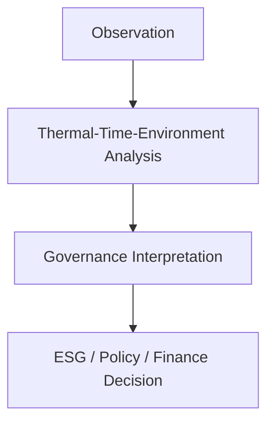

## I. Background: The Structural Blind Spot of "Heat—Time" in Climate Governance

Current global climate governance still largely relies on frameworks built around carbon emissions, annual targets, and statistical indicators. However, the core variables that trigger regional climate anomalies and extreme weather events are not necessarily the total volume of emissions, but rather the temporal rhythm of thermal disturbances.

For example:
- Continuous urban heat accumulation → disruption of vapor channels → precipitation displacement and inland aridification;
- Human-induced high-frequency heat fluxes disturb microclimate structures → deform cloud pathways and generate small-scale extreme weather.

These phenomena reveal that the "thermal signals" of carbon behaviors exhibit strong temporality, spatial specificity, and nonlinear feedback. Therefore, if climate governance continues to operate on static, statistical logic, it will be incapable of capturing real-time feedback and dynamic risk.

## II. Overview of the TTEG Theory Framework

**TTEG (Thermal-Time-Environment Governance)** is a regulatory theory for the AI era that links urban systems, atmospheric dynamics, and ecological feedback:

| Module | Explanation | Examples |
|--------|-------------|----------|
| Thermal | Identify and forecast accumulation and diffusion trends of urban/industrial heat sources | Nighttime urban heat island maps; daytime surface heat prediction zones |
| Time | Develop optimized algorithms for "heat release - cooling - diffusion - rehydration" timing windows | Schedule heat-induced rainfall experiments during nighttime or before holidays |
| Environment | Integrate AI-based monitoring of microclimate changes, soil moisture, air saturation | AI microclimate assistant suggests "vapor compensation" or "delay heat discharge" |

This system emphasizes a tri-dimensional coordination logic (heat flow - time rhythm - spatial dynamics), enabling precise heat release, timely rainfall induction, and minimally invasive climate engineering.

## III. TTEG × Ecological Chain: Institutional Interoperability Design

The integration of TTEG theory with the Ecological Chain is a bi-directional coupling of dynamic signals and governance feedback:

| TTEG Dimension | Mapped Function in the Ecological Chain | Joint Mechanism Proposal |
|----------------|----------------------------------------|------------------------|
| Thermal Disturbance Detection | On-chain carbon-heat factor registration system | Introduce heat-behavior credit alerts that influence carbon asset prices in real time |
| Time Rhythm Optimization | AI-driven rhythm scheduling contracts | Create decentralized consensus on "optimal heat release timing" |
| Environmental System Feedback | ESG-based urban autonomous governance nodes | Build "urban carbon accounts + spatiotemporal credit" structures |
| Urban Spatial Control | DAO governance + RWA allocation by micro-terrain weight | Transform green space, water bodies, and wind corridors into "spatiotemporal regulation nodes" |

## IV. China-Europe Application and Global South Breakthrough

**China's Application Potential:**
TTEG can serve as the technical foundation for climate adaptation and green transition across urban and rural landscapes, enabling local governments to use AI to predict and regulate thermal disturbances, deploy thermal-water-carbon coupling networks, and build "heat-carbon rights" trading frameworks.

**EU Collaboration Value:**
TTEG introduces the concept of "thermal disturbance responsibility"-a time-weighted factor that can enhance the dynamism and physical grounding of green product carbon labeling, strengthening CBAM's systemic fairness and scientific validity.

**A Breakthrough Pathway for the Global South:**
In regions like Africa and South Asia, where infrastructure is underdeveloped yet ecological stress is severe, TTEG offers the possibility of "non-engineering-based regulation," including optimizing time rhythms to manage thermal peaks and designing WSUD systems using thermal-wind flow analysis.

## V. Conclusion: Reconstructing the Time Dimension in Climate Governance

*"We are not merely managing carbon-we are managing a destabilized 'heat-rhythm-vapor system.' Only through systemic theories like TTEG can we enter a new era of rhythmic ecological governance in the age of AI."*

TTEG is not a localized regulatory tool-it is a dynamic re-modeling method for the entire carbon behavior system. In combination with the Ecological Chain institutional framework, it fills the global system's structural gap in capturing temporal, behavioral, and spatial interactivity. TTEG also provides a universal structural language for carbon coordination between China and Europe, thermal discharge responsibility, and ecological algorithmic governance.
